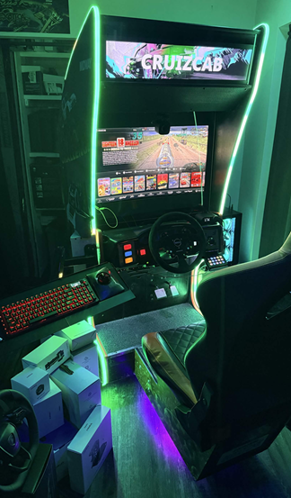
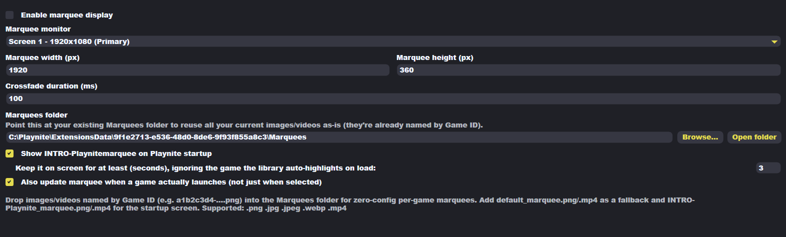

# Marquee Display for Playnite

A Playnite extension that displays a game-specific marquee image or video on
a second monitor or dedicated marquee panel — automatically, as you browse
and launch games. Built for arcade cabinets, but works on any second-monitor
setup.


[](https://buymeacoffee.com/rawrcarnag3)

## Features

- 🎮 Shows a per-game marquee the moment you select or launch a game — no
  external scripts, no manual Script Actions, just install and go.
- 🎬 Smooth crossfades on a persistent full-screen black window, so nothing
  flashes through mid-transition.
- 🖼️ Supports both static images (`.png` `.jpg` `.jpeg` `.webp`) and looping
  muted video (`.mp4`).
- 🚀 Optional startup intro screen, held for a configurable delay so it
  isn't immediately bumped off by Playnite auto-highlighting your first
  library item.
- ⚙️ Fully configurable from Playnite's own Settings UI — target monitor,
  marquee size, crossfade duration, and your Marquees folder location.

## Installing

**Once listed in Playnite's Add-ons browser:** search "Marquee Display"
under Add-ons → Browse, or use the direct install link:

```
playnite://playnite/installaddon/MarqueePlaynite_9f1e2713_Plugin
```

**Manual install:** grab the latest `.pext` from
[Releases](../../releases), then in Playnite: **Add-ons → Install add-on
from file**.

## Setting it up

1. Open **Add-ons → Extension settings → Marquee Display**.
2. Point **Marquees folder** at a folder containing your images/videos.
3. Drop files into it named:
   - `<GameId>.png` (or `.jpg`/`.jpeg`/`.webp`/`.mp4`) — shown for that
     specific game (find the Game ID by right-clicking a game → hover
     "Copy" in the context menu, or check Playnite's game details).
   - `<Game Name>.png` — shown by exact title match if no ID match exists.
   - `default_marquee.png` — fallback for any game without a specific
     marquee.
   - `INTRO-Playnite_marquee.png` — shown on Playnite startup.
4. Pick your monitor, marquee width/height, and enable it.

## Screenshots


*The marquee in action on the cab*


*Configuring monitor, size, and Marquees folder from Playnite's own settings UI*

## Building from source

Requires **Visual Studio 2022** (or Rider) with the **.NET desktop
development** workload, on Windows.

1. Open `MarqueePlaynite.csproj`. It's an SDK-style project targeting
   `.NET Framework 4.6.2` with WPF + WinForms enabled, and pulls the
   `PlayniteSDK` NuGet package automatically on first build.
2. Build (`Ctrl+Shift+B`). If NuGet doesn't restore automatically,
   right-click the project → **Restore NuGet Packages**.
3. Output lands in `bin\Debug\` (or `bin\Release\`) as
   `MarqueePlaynite.dll`, with `extension.yaml` and `icon.png` copied
   alongside it.

For quick iteration without reinstalling each time: Playnite → **Settings →
For developers** → add your build output folder under **External
extensions**, then restart Playnite to load straight from there.

To package a distributable `.pext`:

```cmd
Toolbox.exe pack "path\to\MarqueePlaynite\bin\Release" "path\to\output\folder"
```

(`Toolbox.exe` ships with your Playnite install.)

## Notes

- The marquee window is positioned in raw physical pixels, so if your
  marquee monitor runs at anything other than 100% Windows display scaling,
  positioning can be slightly off — a Windows/WPF quirk. Not an issue for a
  dedicated panel running at native/100% scale.
- `.webp` images need the "Webp Image Extensions" codec from the Microsoft
  Store to decode.
- `MarqueePlaynite.csproj` pins `PlayniteSDK` version `6.16.0`. If your
  Playnite install needs a different version, check
  [nuget.org/packages/PlayniteSDK](https://www.nuget.org/packages/PlayniteSDK)
  and update the `<PackageReference>` in the csproj.

## License

MIT — see [LICENSE](LICENSE).
